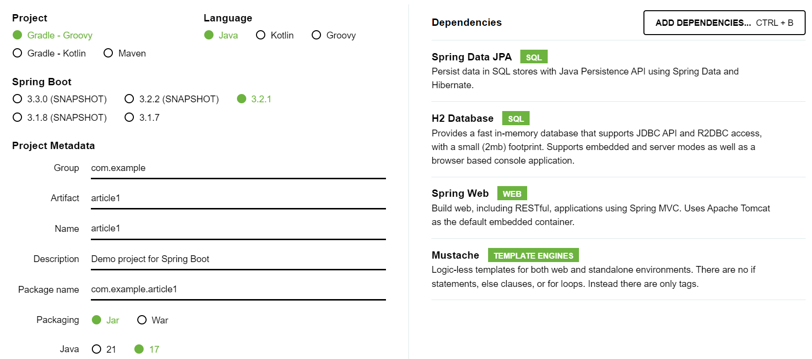
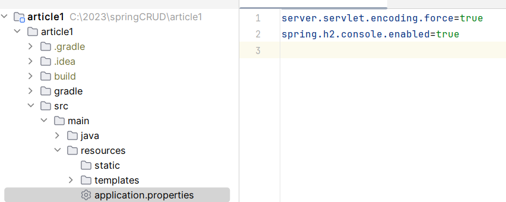
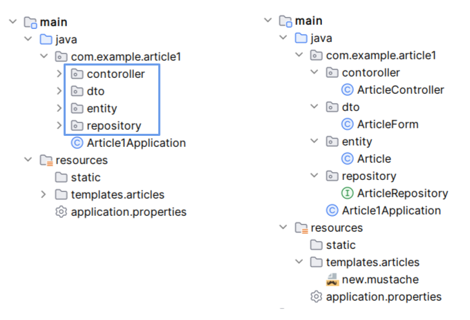
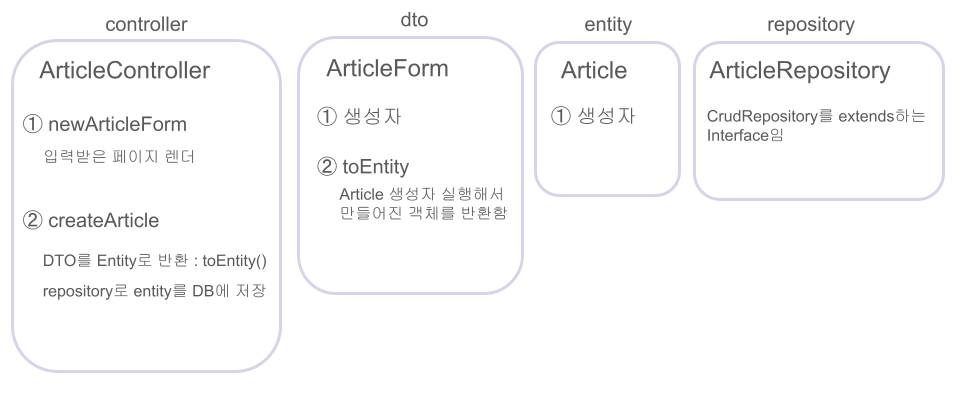

# article1
- [spring initializr](https://start.spring.io/) 접속해서 설정사항이랑 같이 가져올 Dependencies 정하기
  
  
- 프로젝트 만들고 확인할 접속주소는 **localhost:8080**  
- doc + **tab** : mustache에서의 html 기본 틀 생성 단축키 
- ##### web에서 한글깨짐 현상 :
  - main > resources > application.properties 로 들어가기
  - server.servlet.encoding.force=true 입력
    
- H2 DB 접속하기 : `jdbc:h2:mem:메모리주소` 입력하고 입장  
- h2에서는 sql 쌍따옴표 안먹힘 : 홑따옴표 써야됨
  
# 정리

